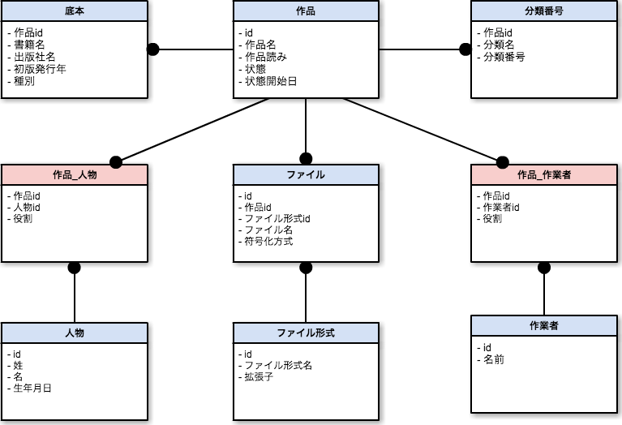

# 青空文庫CSVファイルの構成について

青空文庫では、作品のメタデータをCSVファイルの形式で配布しています。

- 作家別作品一覧CSVファイル http://www.aozora.gr.jp/index_pages/list_person_all_utf8.zip
- 作家別作品一覧拡充版CSVファイル http://www.aozora.gr.jp/index_pages/list_person_all_extended_utf8.zip

## CSVのカラム構成

このうち、作家別作品一覧拡充版CSVファイルの各カラムは、以下のようになっています。

※下記の「テーブル」「カラム」は実際に使用しているDBを簡略化したもので、実際の定義とは異なります。

| CSVヘッダ                    | テーブル | カラム           | 備考                                 |
|------------------------------|----------|------------------|--------------------------------------|
| 作品ID                       | 作品     | ID               |                                      |
| 作品名                       | 作品     | 作品名           |                                      |
| 作品名読み                   | 作品     | 作品名読み       |                                      |
| ソート用読み                 | 作品     | ソート用読み     |                                      |
| 副題                         | 作品     | 副題             |                                      |
| 副題読み                     | 作品     | 副題読み         |                                      |
| 原題                         | 作品     | 原題             |                                      |
| 初出                         | 作品     | 初出             |                                      |
| 分類番号                     | 分類番号 | 分類名＋分類番号 |                                      |
| 文字遣い種別                 | 作品     | 仮名遣い種別     |                                      |
| 作品著作権フラグ             | 作品     | 著作権フラグ     |                                      |
| 公開日                       | 作品     | 状態開始日       | 状態=公開                            |
| 最終更新日                   | 作品     | 最終更新日       |                                      |
| 図書カードURL                | -        | -                | 人物IDと作品IDから生成               |
| 人物ID                       | 人物     | ID               |                                      |
| 姓                           | 人物     | 姓               |                                      |
| 名                           | 人物     | 名               |                                      |
| 姓読み                       | 人物     | 姓読み           |                                      |
| 名読み                       | 人物     | 名読み           |                                      |
| 姓読みソート用               | 人物     | 姓読みソート用   |                                      |
| 名読みソート用               | 人物     | 名読みソート用   |                                      |
| 姓ローマ字                   | 人物     | 姓ローマ字       |                                      |
| 名ローマ字                   | 人物     | 名ローマ字       |                                      |
| 役割フラグ                   | 作品_人物| 役割             |                                      |
| 生年月日                     | 人物     | 生年月日         |                                      |
| 没年月日                     | 人物     | 没年月日         |                                      |
| 人物著作権フラグ             | 人物     | 人物著作権フラグ |                                      |
| 底本名1                      | 底本     | 書籍名           | 種別=底本                            |
| 底本出版社名1                | 底本     | 出版社名         | 種別=底本                            |
| 底本初版発行年1              | 底本     | 初版発行年       | 種別=底本                            |
| 入力に使用した版1            | 底本     | 入力に使用した版 | 種別=底本                            |
| 校正に使用した版1            | 底本     | 校正に使用した版 | 種別=底本                            |
| 底本の親本名1                | 底本     | 書籍名           | 種別=底本の親本                      |
| 底本の親本出版社名1          | 底本     | 出版社名         | 種別=底本の親本                      |
| 底本の親本初版発行年1        | 底本     | 初版発行年       | 種別=底本の親本                      |
| 底本名2                      | 底本     | 書籍名           | 種別=底本                            |
| 底本出版社名2                | 底本     | 出版社名         | 種別=底本                            |
| 底本初版発行年2              | 底本     | 初版発行年       | 種別=底本                            |
| 入力に使用した版2            | 底本     | 入力に使用した版 | 種別=底本                            |
| 校正に使用した版2            | 底本     | 校正に使用した版 | 種別=底本                            |
| 底本の親本名2                | 底本     | 書籍名           | 種別=底本の親本                      |
| 底本の親本出版社名2          | 底本     | 出版社名         | 種別=底本の親本                      |
| 底本の親本初版発行年2        | 底本     | 初版発行年       | 種別=底本の親本                      |
| 入力者                       | 作業者   | 名前             | 役割=入力者                          |
| 校正者                       | 作業者   | 名前             | 役割=校正者                          |
| テキストファイルURL          | -        | -                | 人物IDとファイル名から生成           |
| テキストファイル最終更新日   | ファイル | 最終更新日       |                                      |
| テキストファイル符号化方式   | ファイル | 符号化方式       | ShiftJIS/JIS/EUC/UTF-8/その他        |
| テキストファイル文字集合     | ファイル | 文字集合         | JIS X 0208/JIS X 0213/Unicode/その他 |
| テキストファイル修正回数     | ファイル | 修正回数         |                                      |
| XHTML/HTMLファイルURL        | -        | -                | 人物IDとファイル名から生成           |
| XHTML/HTMLファイル最終更新日 | ファイル | 最終更新日       |                                      |
| XHTML/HTMLファイル符号化方式 | ファイル | 符号化方式       | ShiftJIS/JIS/EUC/UTF-8/その他        |
| XHTML/HTMLファイル文字集合   | ファイル | 文字集合         | JIS X 0208/JIS X 0213/Unicode/その他 |
| XHTML/HTMLファイル修正回数   | ファイル | 修正回数         |                                      |

## テーブル構成

上記の表で想定しているテーブル構成は以下の図のようになっています。
カラムは一部のみ記載しています。

